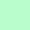
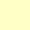

<h2 align="center">
	SAGA  
	
</h2> 
<h4 align="center">A dark theme with colourful shades of pastel   </h4>  

|                                 COLOUR                                        | NAME     | HEX       | RGB             | HSL             | CMYK               |  
| ----------------------------------------------------------------------- | -------- | --------- | --------------- | --------------- | ------------------ |
|       | C1    | `#05080a` | `5,8,10` | `204,33.3%,2.9%` | `50,20,0,96`  |
|     | C2 | `#0A0D0F` | `10,13,15`    | `204,20%,4.9%`  | `33,13,0,94` |
|     |  C3 | `#0f1214` | `15,18,20`    | `204,14.3%,6.9%`  | `25,10,0,92` |
|       |  C4 | `#141719` | `20,23,25` | `204,11.1%,8.8%`   | `20,8,0,90` |
|      | C5      | `#fad5d5` | `245,208,208` | `0,64.9%,88.8%` | `0,15,15,4` |
|     | C6  | `#ffc2d0` | `255,194,208` | `346.2,100%,88%` | `0,24,18,0`  |
|     | C7    | `#ffb7b2` | `255,183,178` | `3.9,100%,84.9%` | `0,28,30,0`  |
|      | C8  | `#b9fdcd` | `185,253,205` | `137.6,94.4%,85.9%` | `27,0,19,1`  |
|    | C9 | `#ffffc6` | `255,255,198` | `60,100%,88.8%` | `0,0,22,0` |
|    | C10 | `#ffe1b1` | `255,225,177` | `36.9,100%,84.7%` | `0,12,31,0` |
|      | C11      | `#C4FFFE` | `196,255,254` | `179,100%,88.4%` | `23,0,0,0` |
|     | C12   | `#d7caed` | `215,202,237` | `262.3,49.3%,86.1%`  | `9,15,0,7` |
|     | C13   | `#dccff2` | `220,207,242` | `262.3,57.4%,88%`  | `9,14,0,5` |
|    | C14  | `#e6d9fc` | `230,217,252` | `262.3,85.4%,92%`  | `9,14,0,1`  |
|     | C15  | `#f0e3ff` | `240,227,255` | `267.9,100%,94.5%` | `6,11,0,0` |
|      | C16   | `#faedff` | `250,237,255` | `283.3,100%,96.5%` | `2,7,0,0`  |

	

## Ports
- [NvChad](https://github.com/SAGAtheme/nvchad)
- [Rofi](https://github.com/SAGAtheme/Rofi)
- [Cava](https://github.com/SAGAtheme/Cava)
- [LeftWM](https://github.com/SAGAtheme/LeftWM)
- [Xresources](https://github.com/SAGAtheme/Xresources)
- [Firefox](https://github.com/SAGAtheme/Firefox)
- [Spotify](https://github.com/SAGAtheme/Spotify)
- [Obsidian](https://github.com/SAGAtheme/nvchad)
- [Gedit](https://github.com/SAGAtheme/Gedit)
- [Logseq](https://github.com/SAGAtheme/Logseq)
- [SAGAfont](https://github.com/SAGAtheme/nvchad)

## Showcase
A list of complete setups using the SAGA colourscheme along with screenshots can be found [here](https://github.com/SAGAtheme/Showcase). If you want to submit your setup feel free to open a pull request or create an issue. 

## Contributing
If you want to create or share a theme using the SAGA palette for an application that does not yet have one you can submit a [PR](https://github.com/SAGAtheme/SAGA/pulls). 

