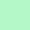

<h2 align="center">
	SAGA  
	
</h2> 
<h4 align="center">A dark theme with colourful shades of pastel   </h4>  

|                                 COLOUR                                        | NAME     | HEX       | RGB             | HSL             | CMYK               |  
| ----------------------------------------------------------------------- | -------- | --------- | --------------- | --------------- | ------------------ |
|       | C1    | `#0A0D0F` | `10,13,15` | `204,20%,4.9%` | `33,13,0,94`  |
|     | C2 | `#0F1214` | `15,18,20`    | `204,14.3%,6.9%`  | `25,10,0,92` |
|     |  C3 | `#141719` | `20,23,25`    | `204,11.1%,8.8%`  | `20,8,0,90` |
|       |  C4 | `#191C1E` | `25,28,30` | `204,9.1%,10.8%`   | `17,7,0,88` |
|      | C5      | `#F5D0D0` | `245,208,208` | `0,64.9%,88.8%` | `0,15,15,4` |
|     | C6  | `#FFBDCB` | `255,189,203` | `347.3,100%,87.1%` | `0,26,20,0`  |
|     | C7    | `#FFB2AD` | `255,178,173` | `3.7,100%,83.9%` | `0,30,32,0`  |
|      | C8  | `#B4F8C8` | `180,248,200` | `137.6,82.9%,83.9%` | `27,0,19,3`  |
|    | C9 | `#FFFFC1` | `255,255,193` | `60,100%,87.8%` | `0,0,24,0` |
|    | C10 | `#FFDCAC` | `255,220,172` | `34.7,100%,83.7%` | `0,14,33,0` |
|      | C11      | `#BFFBF9` | `180,251,249` | `178.3,89.9%,84.5%` | `28,0,1,2` |
|     | C12   | `#D2C5E8` | `210,197,232` | `262.3,43.2%,84.1%`  | `9,15,0,9` |
|     | C13   | `#FAEDFF` | `250,237,255` | `283.3,100%,96.5%`  | `2,7,0,0` |
|    | C14  | `#F5E8FF` | `245,232,255` | `273.9,100%,95.5%`  | `4,9,0,0`  |
|     | C15  | `#FFF2FF` | `255,242,255` | `300,100%,97.5%` | `0,5,0,0` |
|      | C16   | `#FFFCFF` | `255,252,255` | `300,100%,99.4%` | `0,1,0,0`  |

	

### Notes
This theme is a small personal project of mine. I will continue to add theme templates for applications I find useful however there are no plans to expand it further than that. If you want to create and share a theme using the SAGA palette for an application that does not yet have one you can submit a [PR](https://github.com/SAGAtheme/SAGA/pulls). 

Available themes can be found [here](https://github.com/SAGAtheme).

